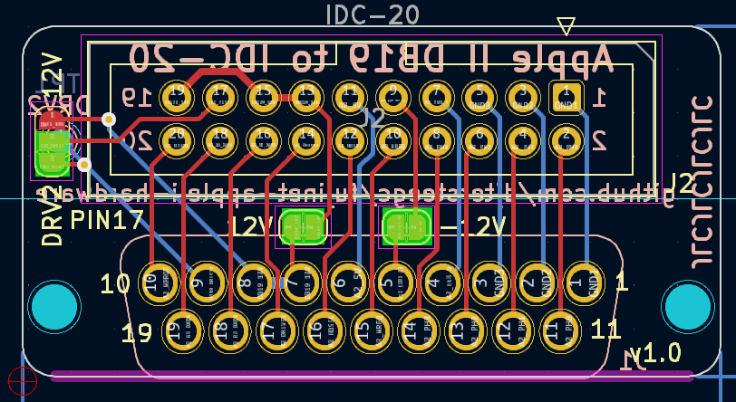
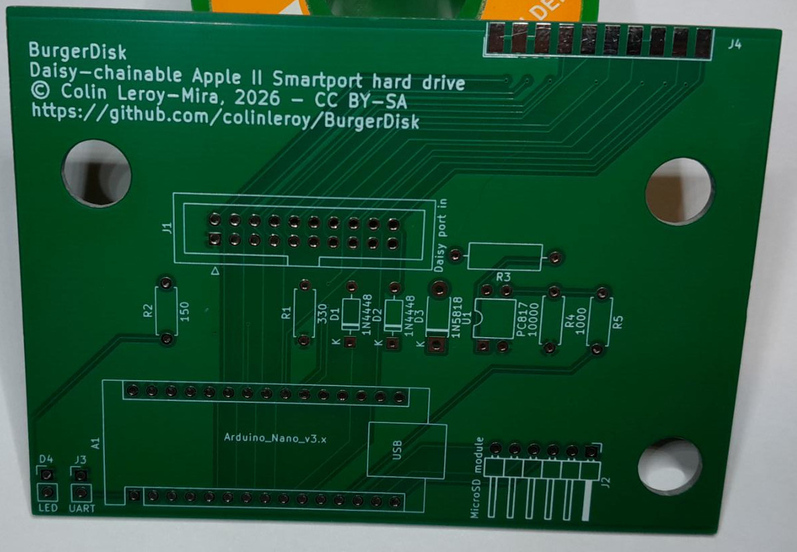
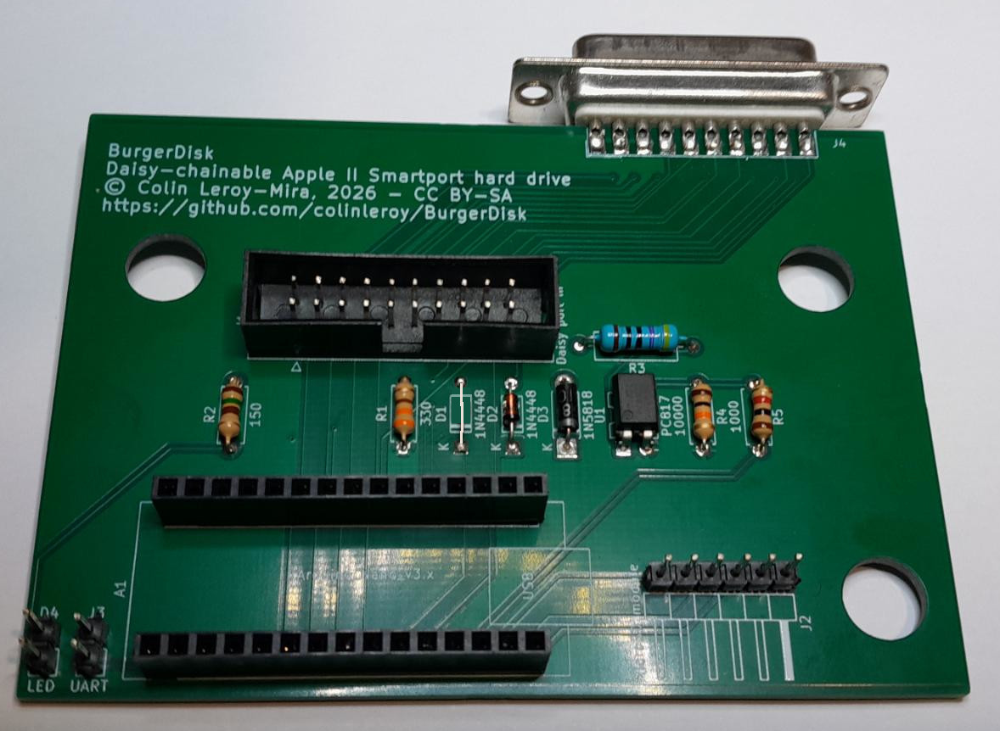
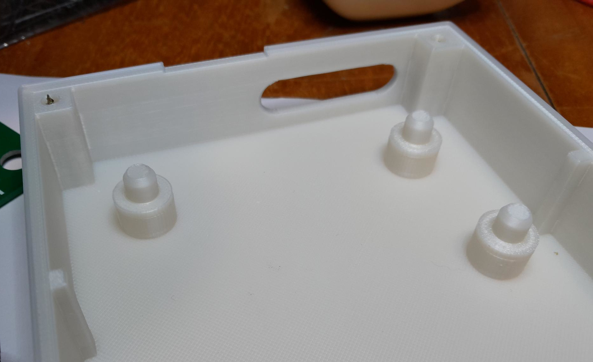
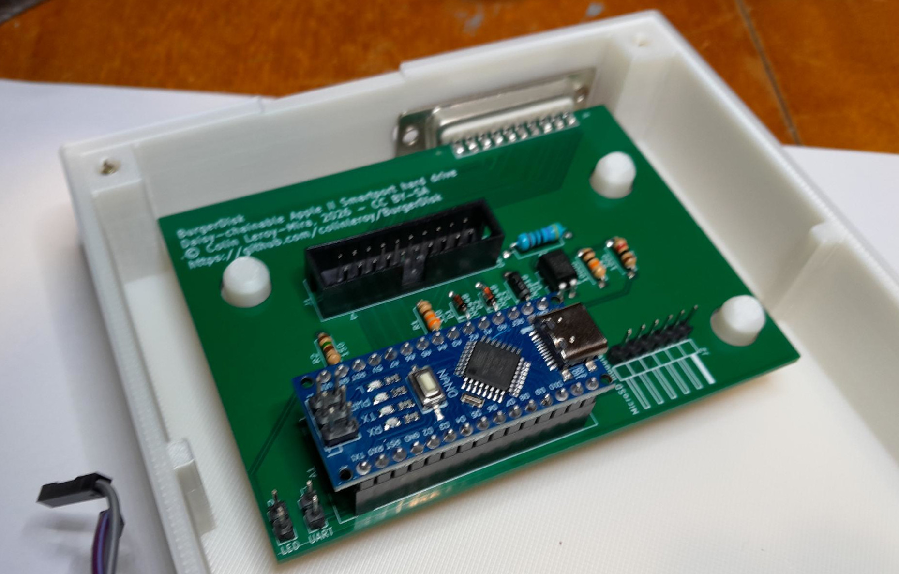

# Building the BurgerDisk

## BOM (bill of materials)
Mind that the links provided here might be dead by the time you read this, and
that most of them have options (number of pins, resistor values, etc) that you
should double-check before buying.

For the main board, you will need:
- one female DB19 connector, [solder type](https://www.ebay.com/itm/165875193091) or
  [angled](https://www.ebay.com/itm/284338436979), for daisy-chaining
- the main PCB's [Gerber files](../../../releases/latest/). You can get them easily
  from PCBWay: [for solder type DB19](https://www.pcbway.com/project/shareproject/BurgerDisk_Apple_II_Smartport_hard_drive_235e6080.html), 
  or [for angled DB19](https://www.pcbway.com/project/shareproject/BurgerDisk_Apple_II_Smartport_hard_drive_Angled_THT_DB19_d37bdb0f.html)
- one [Arduino Nano with an Atmega328p processor](https://aliexpress.com/item/1005006773519913.html)
- one [STK500 AVR ISP programmer](https://aliexpress.com/item/1005006205386137.html) for uploading the firmware to the Arduino
- one [IDC20 connector, male, 2.54mm pitch](https://aliexpress.com/item/1005001400147026.html)
- one [470Ω resistor, 1/2W](https://aliexpress.com/item/1005004472952572.html)
- one [150Ω resistor, 1/4W](https://aliexpress.com/item/32952657927.html)
- one [330Ω resistor, 1/4W](https://aliexpress.com/item/32952657927.html)
- one [1kΩ resistor, 1/4W](https://aliexpress.com/item/32952657927.html)
- one [10kΩ resistor, 1/4W](https://aliexpress.com/item/32952657927.html)
- one [3mm LED, 3V, 20mA](https://fr.aliexpress.com/item/1005003320296052.html)
- one [PC817 optocoupler (DIP-4)](https://aliexpress.com/item/1005004609787594.html)
- one [1N5818 diode](https://aliexpress.com/item/4000055728807.html)
- two [1N4448 diodes](https://aliexpress.com/item/1005008591345474.html)
- two [2-pin male headers, 2.54mm pitch](https://aliexpress.com/item/1005006181780843.html)
- one [microSD module ("TF")](https://aliexpress.com/item/1005008633757049.html)
- one [6-pin male header, 2.54mm pitch](https://aliexpress.com/item/1005006181780843.html) for the MicroSD module
- one [6-pin cable, 2.54mm pitch, 10cm long](https://aliexpress.com/item/4001119232749.html) for the MicroSD module
- one [2-pin cable, 2.54mm pitch, 20cm long](https://aliexpress.com/item/4001119232749.html) for the LED
- two [15-pin female header](https://aliexpress.com/item/1005006934014275.html) for easy Arduino removal

For connecting to the computer, you will need:
- an Apple 3.5 drive cable or equivalent, or make it yourself using
  - the [DB19 to IDC20 PCB](https://www.pcbway.com/project/shareproject/BurgerDisk_DB19_to_IDC20_adapter_d6ce25bb.html)
    or its [Gerber files](../../../releases/latest)
  - an [IDC20 cable, 2.54mm pitch](https://aliexpress.com/item/1005003853804182.html), at least 50cm
  - a second [IDC20 connector, male, 2.54mm pitch](https://aliexpress.com/item/1005001400147026.html)
  - one [male DB19 connector](https://www.ebay.com/itm/257181325655)
  - two [M2 x 12mm screws](https://aliexpress.com/item/33043885403.html)
- The [Fujinet's DB19/IDC20 adapter](https://github.com/FujiNetWIFI/fujinet-hardware/tree/master/AppleII/DB-19M-Adapter-Male-Rev1)
can be used, provided that you solder the -12V and +12V pads between the IDC20
and the DB19, and the DRV2 pad on the side:


For the enclosure, you will need:
- the [enclosure's STL files](../enclosure/)
- four [M3 x 20mm wood screws](https://aliexpress.com/item/33043885403.html)
- two [M2 x 12mm screws](https://aliexpress.com/item/33043885403.html)
- optionally, a [500 grams weight](https://aliexpress.com/item/1005007419997918.html)
  (and glue) to make the enclosure heavier and avoid thick-cables-induced levitation.
  (I found diving belt weights to have the best price-to-weight ratio but you can
  use whatever you want or have available).

## Printing the enclosure
You can use the .stl files provided in [this repository](../enclosure/).
So far I print the enclosure at 15% infill, 0.20mm layer height. With my printer
I don't need support for the overhangs on the slots at the back, but your mileage
may vary.

## Building the main PCB
**All elements are to be soldered on the top-side of the PCB**, the side with the
markings, except for the MicroSD card module.



### Daisy DB19
Align the female DB19 connector with the Daisy out pads on the PCB. Pay close
attention to the alignment, as the DB19 will basically be un-desolderable with
basic equipment. Solder it.

### Small components: Resistors, diodes and optocoupler
Insert the 150Ω resistor in its spot, (R2/150).

Insert the 330Ω resistor in its spot (R1/330).

Insert the 470Ω resistor in its spot (R3/470).

Insert the 10kΩ resistor in its spot (R4/10000).

Insert the 1kΩ resistor in its spot (R5/1000).

Resistors are not polarized, so you can put them either way.

Insert the two 1N4448 diodes in their spots (D1 and D2 / 1N4448). Mind that diodes
**are** polarized, so make sure the line on the PCB silkscreen and the line on
the diode are facing the same way.

Insert the 1N5818 diode in its spot, (D3/1N5818).

Insert the PC817 optocoupler in its spot (U1/PC817). The small round
mark on the PC817 is the anode, and goes to the hole with a square solder mask.

Make these components stay in place, either by bending their legs or taping them.

Solder them.

### 2-pin headers
Insert one 2-pin male headers in the "UART" and "LED" spots. Solder them.

### Input IDC-20 connector
Insert the IDC-20 connector in its spot. Mind the notch position, it must be
towards the bottom of the PCB. Solder it.

### Arduino Nano
Solder the Nano's 6-pin header for programming on top of the Nano. The top of
the Nano is the side with the USB connector and the reset button.

This is not strictly necessary, but I like to put the Nano on a "socket" so that
it is easy to replace if necessary.

Assemble the Nano's two 15-pin connector with the 15-pin female connectors.
Insert these on the PCB, in the "NANO" spot, with the female headers towards
the PCB. 

Insert the Nano on top of its 15-pins connectors. Make sure the USB port is
facing left, over the "USB conn" marking on the PCB. Solder the 30 pins to the
Nano.

Reverse the PCB, and solder the female headers' 30 pins to the PCB.

You can [program the Arduino at this point](../firmware/README.md).

### MicroSD card module connector
Solder the 6-pin male header on the "MicroSD module" spot.

Your PCB now looks like this:


### LED
Solder the LED to about 15 cm of Dupont wire connectors.

## The main connection cable
Because of its daisy-chaining capabilities, the cable to plug BurgerDisk to the
Apple II is more complicated than most DB19-to-IDC20 adapters.

The correct DB19-to-IDC20 adapter for this project is provided in this
repository.

It replicates the wiring of the **Apple 3.5 drive cable**, so using such a cable
from a broken floppy drive is also an option. I suppose, but did not verify, that
it would also work with a Unidisk cable. The necessary wiring is as follows:

```
Male DB19, seen from front:

1  2  3  4  5  6  7  8  9  10
 11 12 13 14 15 16 17 18 19

Female IDC20, seen from front, ==== is the connector's notch:

20  18  16  14  12  10  8  6  4  2
19  17  15  13  11  9   7  5  3  1
                ====

Wiring:

DB19 pin      IDC20 pin      line
1             1              GND
2             3              GND
3             5              GND
4             7              EN35
5             9              -12V
6             11             +5V
7             13             +12V
8             15             +12V
9             17             DRV2
10            20             WRPROT
11            2              PH0
12            4              PH1
13            6              PH2
14            8              PH3
15            10             WREQ
16            12             HDSEL
17            14             DRV1
18            16             RDDATA
19            18             WRDATA
```

This is the wiring provided by the DB19-to-IDC20 adapter in this repository.

### Assembling the adapter-based cable
Align the male DB19 connector with the pads on the adapter PCB. Pay attention
to the alignment, as the DB19 connector will basically be un-desolderable.
Solder it.

Insert the IDC-20 connector in the adapter PCB. It must on the top-side of the
PCB, where the IDC-20 is outlined on the silkscreen. Pay attention to the notch
position, which should be towards the DB19 connector. Solder it.

Insert the assembled adapter into its enclosure, and screw it shut with two M2
x 12mm screws.

## Assembling in the enclosure
Put washers on the enclosure mounting posts: 2mm if you are using the angled
DB19 female connector, or 9mm (2 + 7) if you're using the "solder type" DB19
connector.



Put the PCB in the enclosure's bottom, making sure the enclosure notches
are in the PCB mounting holes.



If using the angled DB19, put the 7mm washers on top of the PCB.

Screw the MicroSD module with M2 x 12mm screws, face up, at the front of the
enclosure's bottom; then connect it to the PCB using the 6 or 8-pin cable.
**Mind which way you connect!**
When looking from the front of the enclosure, +5V and GND are on the **right**
both on the PCB, and on the MicroSD module.

Plug the main input cable in, and route it out of the enclosure via its dedicated
slot in the back.

Glue a weight in the front of the bottom part if needed (epoxy works well on PLA
and lead). Make sure you leave room for the enclosure top's posts.
Put the enclosure's top on the bottom, making sure the notches are
aligned so that the PCB does not move around. Turn the enclosure on its back,
and screw it closed with four M3 x 20mm screws. There may be some stringing from
the 3D printing in the bottom part of the holes, remove it with a small
screwdriver beforehand if needed.

## Testing everything
Before plugging things in, it is good to check if everything is as expected.
This is not necessary if you're quite certain of your work.

Using a multimeter in "continuity" test mode,
- Verify ground continuity:
  - between the MicroSD module's GND and the GND pins of the Daisy In IDC20
  - between the GND pins of the Daisy In IDC20 and the GD pin of the Nano
  - between the GND pins of the Daisy In IDC20 and the GND pins of the Daisy
    out connector
  - between the GND pins of the Daisy In IDC20 and the GND pin of the UART
  - between the GND pins of the Daisy In IDC20 and the GND pin of the LED
- Verify +5V:
  - between the +5 pin of IDC20 connector (top row, 5th starting from left) and
    +5 of the Daisy Out DB19 (6th from the top, front side of the PCB)
  - plug your input cable, and verify continuity between its +5V pin (pin 6, 6th
    from the top when the DB19 is facing left, front side) and +5 pin of the
    Daisy DB19 (6th from the top, front side of the PCB)
  - between +5V pin of the Arduino and +5V of the MicroSD module
- Arduino:
  - between Arduino D12 and MicroSD MISO
  - between Arduino D11 and MicroSD MOSI
  - between Arduino D10 and MicroSD CS
  - between Arduino D9 and IIgs jumper bottom pin
  - between IIgs jumper top pin and IDC20 DR2
  - between Arduino D8 and Daisy Out P3 (under the PCB)
  - between Arduino D7 and IDC20 WR
  - between Arduino D6 and RD 1N4448 cathode (right side)
  - between Arduino D5 and IDC20 PH3
  - between Arduino D4 and IDC20 PH2
  - between Arduino D2 and IDC20 PH1
  - between Arduino TX and UART jumper top pin
  - between Arduino D13 and MicroSD SCK
  - between Arduino A0 and IDC20 DR1
  - between Arduino A1 and Daisy Out HSL (under the PCB)
  - between Arduino A2 and Daisy Out DR1 (under the PCB)
  - between Arduino A3 and Daisy Out DR2
  - between Arduino A4 and the LED's 150Ω (right side)
  - between Arduino A5 and WPRT 1N4448 cathode (left side)
- IDC20:
  - between DR2 and IIgs jumper top pin
  - between +12 pins and Daisy Out +12 pins
  - between -12 pin and Daisy Out -12 pin
  - between E35 and Daisy Out E35
  - between WPRT and Daisy Out WPT
  - between WPRT and WPRT 1N4448 anode (right side)
  - between RD and Daisy Out RD (under the PCB)
  - between RD and RD 1N4448 anode (left side)
  - between WRQ and Daisy Out WRQ (under the PCB)
- Input cable: 
  - between each matching pin on the DB19 and IDC20
  - connect the input cable to the IDC20, and check between GND pins
    and Daisy Out GND pins
