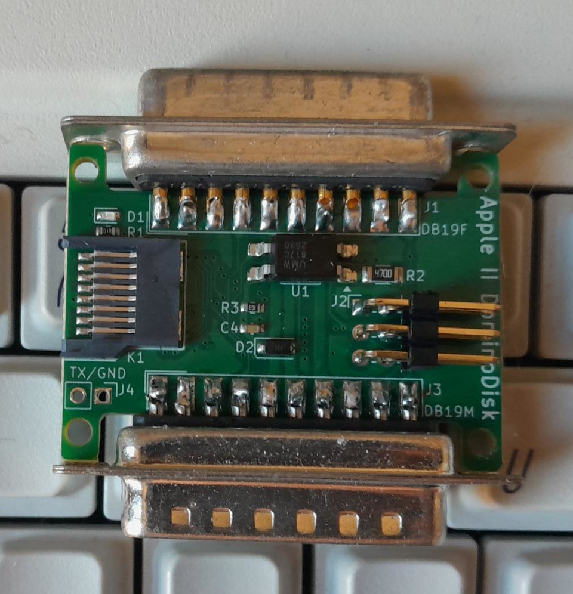
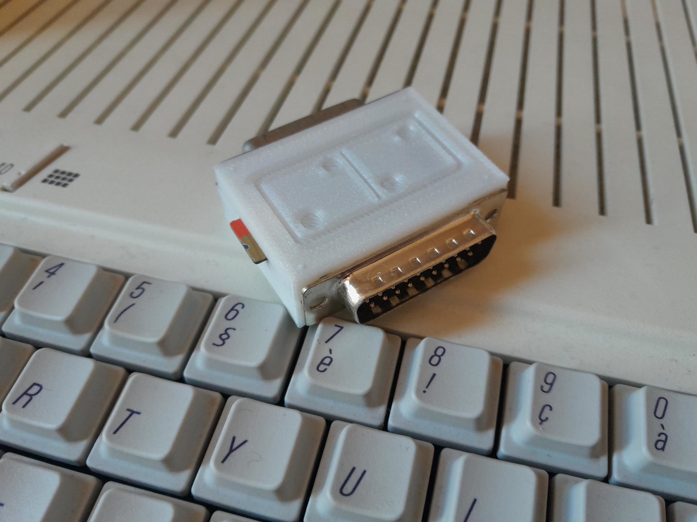

# Building the DominoDisk

## BOM (bill of materials)
Mind that some of the external links provided here might be dead by the time you read this.

**For the main board**, you will need:
- the [assembled main PCB](../PCB/DominoDisk-SMD). Kicad 9 + the 
  [Fabrication toolkit plugin](https://github.com/bennymeg/Fabrication-Toolkit)
  allows for a simple order at JLC, with a few components needing a manual rotation.
  Don't forget to have them assemble **both sides**.
- one female DB19 connector, [solder cups type](https://www.ebay.com/itm/165875193091), for daisy-chaining
- one male DB19 connector, [solder cups type](https://www.ebay.com/itm/116595555769)
- one [STK500 AVR ISP programmer](https://aliexpress.com/item/1005006205386137.html) for uploading the firmware to the Arduino

**For the enclosure**, you will need:
- the [enclosure's STL files](../enclosure/Domino/)
- four [M2 x 12mm wood screws](https://aliexpress.com/item/1005006960903249.html)

## Printing the enclosure
You can use the .stl files provided in [this repository](../enclosure/).
So far I print the enclosure at 100% infill, 0.20mm layer height.

### Finishing the main PCB
Insert the female DB19 connector pins on the PCB, at the J1 (DB19F) edge connector.
Insert the male DB19 connector pins on the PCB, at the J3 (DB19M) edge connector.
Solder them, both sides.

Your PCB now looks like this:

Connect the ISP programmer to its header, notch up (the other way is impossible anyway).
Use `make fuse upload` in the [firmware](../firmware) directory to program the
Atmega. You might need to change the `PROGRAMMER` variable in the `Makefile`.
For the first time, you will need the install the Arduino IDE, and to run 
`make setup` once in the [firmware](../firmware) directory.

