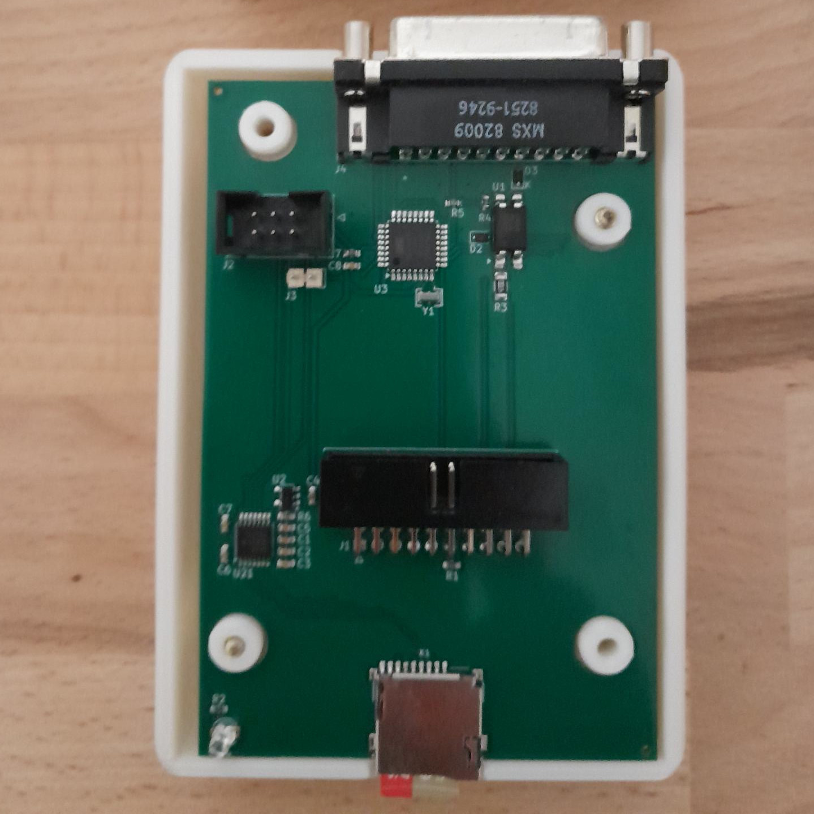
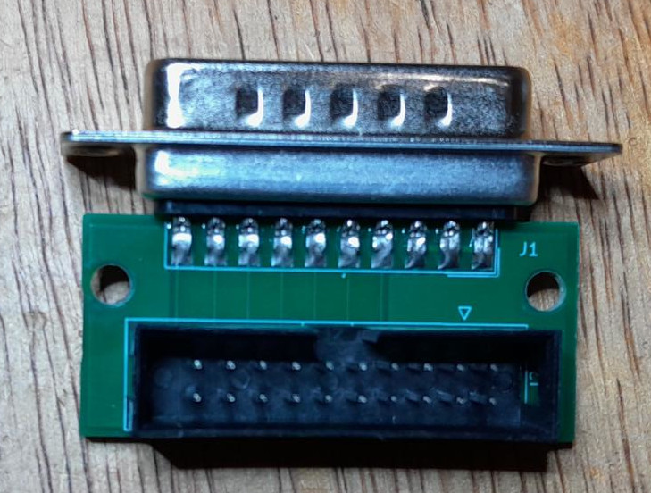
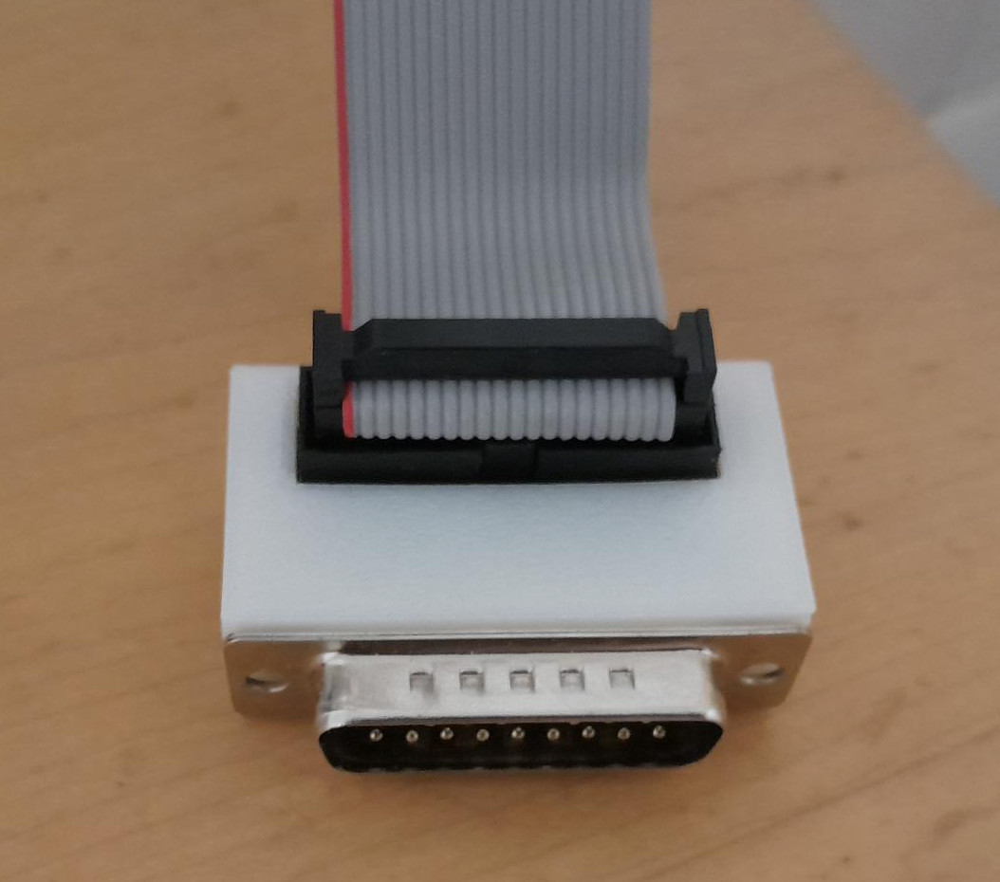
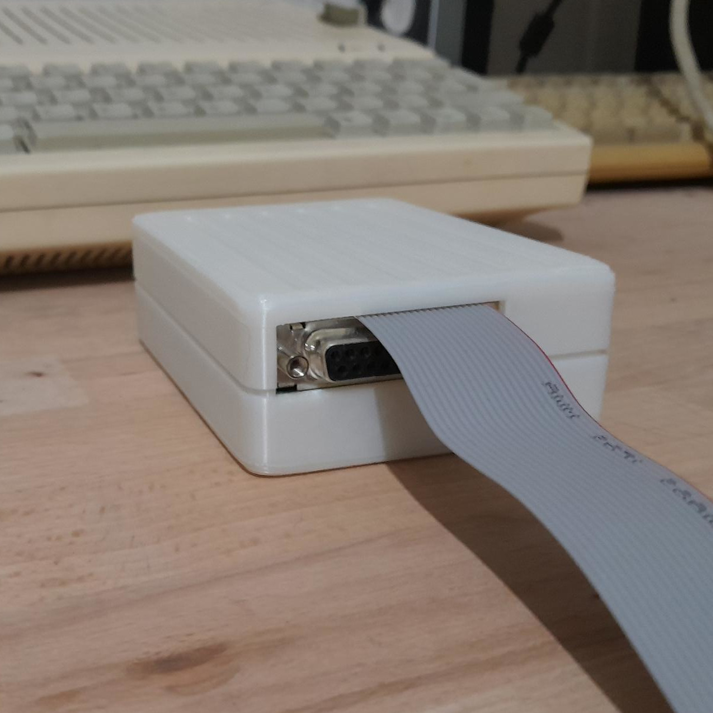

# Building the Mini BurgerDisk

## BOM (bill of materials)
Mind that some of the external links provided here might be dead by the time you read this, and
that some of them have options (number of pins, length, etc) that you should double-check
before buying.

**For the main board**, you will need:
- the [assembled main PCB](../PCB/Small-atmega-SMD). Kicad 9 + the 
  [Fabrication toolkit plugin](https://github.com/bennymeg/Fabrication-Toolkit)
  allows for a simple order at JLC, with a few components needing a manual rotation
- one female DB19 connector, [angled](https://www.ebay.com/itm/284338436979), for daisy-chaining
- one [STK500 AVR ISP programmer](https://aliexpress.com/item/1005006205386137.html) for uploading the firmware to the Arduino

**For connecting to the computer**, you will need:
- The BurgerDisk connection cable, composed of:
  - the [DB19 to IDC20 PCB](../PCB/DB19-IDC20-Adapter)
  - an [IDC20 cable, 2.54mm pitch](https://aliexpress.com/item/1005003853804182.html), at least 50cm
  - an [IDC20 connector, male, 2.54mm pitch](https://aliexpress.com/item/1005001400147026.html)
  - one [male DB19 connector](https://www.ebay.com/itm/257181325655)
  - two [M2 x 12 or 14mm screws](https://aliexpress.com/item/1005006960903249.html)
  - its [enclosure's STL files](../enclosure/Adapter/)
- Alternatively, the [Fujinet's DB19/IDC20 adapter](https://github.com/FujiNetWIFI/fujinet-hardware/tree/master/AppleII/DB-19M-Adapter-Male-Rev1)
can be used, provided that you solder [the -12V and +12V pads between the IDC20
and the DB19, and the DRV2 pad on the side](../build_instructions/pictures/fujinet-db19-adapter.png)

**For the enclosure**, you will need:
- the [enclosure's STL files](../enclosure/Mini/)
- four [M3 x 20mm wood screws](https://aliexpress.com/item/33043885403.html)

## Printing the enclosure
You can use the .stl files provided in [this repository](../enclosure/).
So far I print the enclosure at 15% infill, 0.20mm layer height. With my printer
I don't need support for the overhangs, but your mileage may vary.

### Finishing the main PCB
Insert the female DB19 connector pins on the PCB's top side and clip it. Solder it.

Your PCB now looks like this:

Connect the ISP programmer to its header, and use `make fuse upload` in the
[firmware](../firmware) directory to program the Atmega. You might need to change the
`PROGRAMMER` variable in the `Makefile`. For the first time, you will need the
install the Arduino IDE, and to run `make setup` once in the
[firmware](../firmware) directory.

### Assembling the adapter-based cable
Align the male DB19 connector with the pads on the adapter PCB. Pay attention
to the alignment, as the DB19 connector will basically be un-desolderable.
Solder it.

Insert the IDC-20 connector in the adapter PCB. It must on the top-side of the
PCB, where the IDC-20 is outlined on the silkscreen. Pay attention to the notch
position, which should be towards the DB19 connector. Solder it.

Insert the assembled adapter into its enclosure, and screw it shut with two M2
x 12 (or 14) mm screws.

## Assembling in the enclosure

Connect the IDC-20 cable to both the main PCB and the adapter. The notch is not on
the same side at both ends, so one way is more satisfying than the other. Make it
so the IDC-20 cable goes directly behind the adapter.

Close the enclosure, with the IDC-20 cable exiting right over the DB19, and screw
it shut with 4x20mm screws. Add rubber feet.

