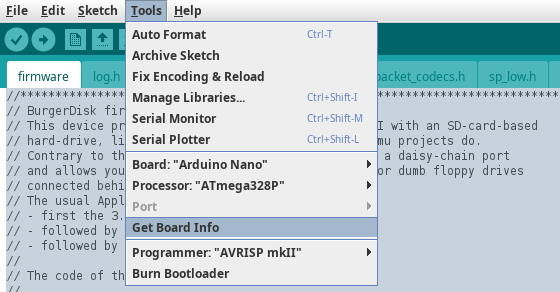
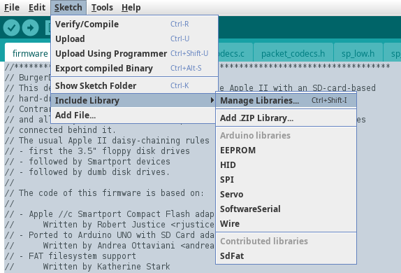
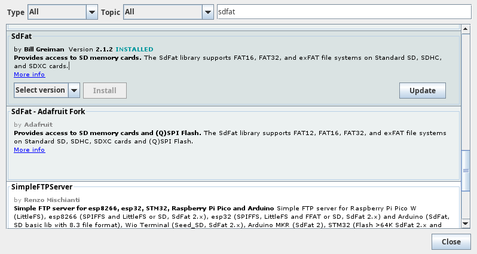
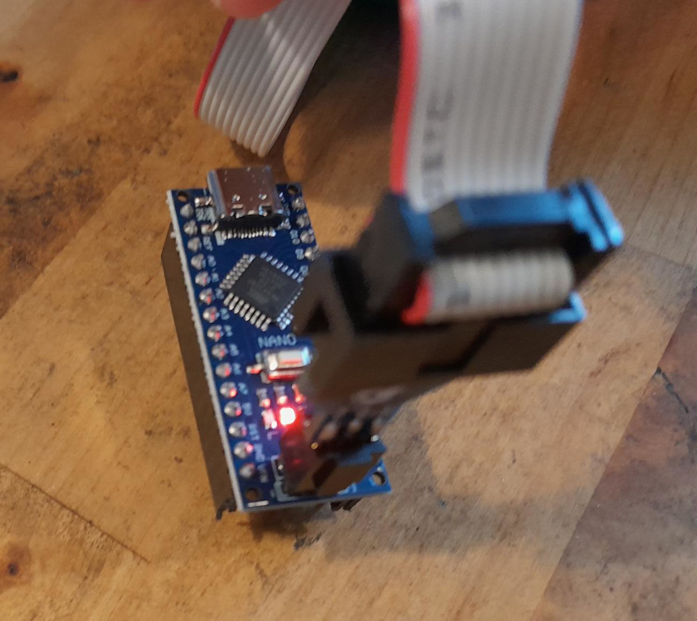
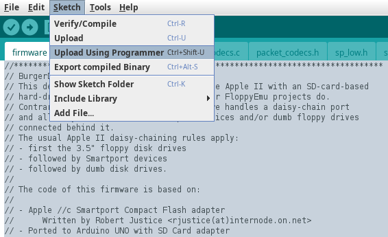

# Programming the Arduino Nano with BurgerDisk's firmware

In order for the Arduino Nano to boot fast enough to answer an Apple //c booting
from its internal floppy, the Nano **has** to be programmed using an AVR ISP
programmer. I use an [STK500 AVR ISP programmer](https://aliexpress.com/item/1005006205386137.html).

Open a terminal, and change to this `firmware/` directory.

## Arduino IDE installation
Install the Arduino IDE, for example on a Debian-based Linux distribution:
```
sudo apt install arduino
```

Start it:
```
arduino .
```

## Arduino IDE configuration
.

In `Tools` menu, `Programmer` submenu, select your programmer.

You can then either continue using the Arduino IDE interactively:
- In `Tools` menu, `Board` submenu, select `Arduino Nano`.
- In `Tools` menu, `Processor` submenu, select `Atmega328p`.
- In `Sketch` menu, `Include Library` submenu, select `Manage Libraries...`.
  .
- Search for `SdFat` by Bill Greiman, scroll to it, and install version 2.1.2.
  

Or, you can quit the Arduino IDE, and in your terminal, run:
```
make setup
```

## Flashing the firmware
**Make sure that the Nano is out of the BurgerDisk PCB, or that the BurgerDisk
is disconnected from the Apple II, even if the Apple II is turned off, before connecting the programmer. NEVER connect the programmer when the BurgerDisk is
connected to the Apple II.**

Connect your Arduino Nano to the programmer's 6-pin connector. The red
wire of the connector must be towards the Nano's `VIN` pin.


Two options here too:
- From the Arduino IDE, `Sketch` menu, choose `Upload using programmer`. Wait
  until the "Done uploading" message.
  
- From the command line, run `make`. Wait for the upload to be done.

Disconnect the programmer, and you're set.

## Debugging
If you need to debug the firmware, you can connect its UART pins to an [UART/USB
converter](https://aliexpress.com/item/1005008293602159.html). Wire the
BurgerDisk's UART `GND` pin to the USB converter `GND` pin, and the BurgerDisk's
UART `TX` pin to the USB converter's `RX` pin.

Plug the USB converter in your computer, check its device file (using `dmesg`
for example), then run:
```
minicom -D /dev/ttyUSB0 -8 -b230400
```

Connect the BurgerDisk to the Apple II, and boot the Apple II. Log messages
should be visible in Minicom. Remember: **never have the programmer connected
while the PCB is connected to an Apple II!**
